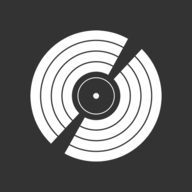

<div id="top"></div>

[![MIT License][license-shield]][license-url]
[![LinkedIn][linkedin-shield]][linkedin-url]

<br />
<div align="center">
  <a href="https://github.com/kerbero1994/DiscogsApp">
    
  </a>

  <h3 align="center">Discogs App</h3>

  <p align="center">
    Small SPA using the Discogs Api
    <br />
    <a href="https://discogsapp.netlify.app">Live Demo</a>
  </p>
</div>

<!-- TABLE OF CONTENTS -->
<details>
  <summary>Table of Contents</summary>
  <ol>
    <li>
      <a href="#about-the-project">About The Project</a>
      <ul>
        <li><a href="#built-with">Built With</a></li>
      </ul>
    </li>
    <li>
      <a href="#getting-started">Getting Started</a>
      <ul>
        <li><a href="#prerequisites">Prerequisites</a></li>
        <li><a href="#installation">Installation</a></li>
      </ul>
    </li>
    <li><a href="#usage">Usage</a></li>
    <li><a href="#roadmap">Roadmap</a></li>
    <li><a href="#contributing">Contributing</a></li>
    <li><a href="#license">License</a></li>
    <li><a href="#contact">Contact</a></li>
    <li><a href="#acknowledgments">Acknowledgments</a></li>
  </ol>
</details>

<!-- ABOUT THE PROJECT -->

## About The Project

[![DiscogsApp][product-screenshot]](https://discogsapp.netlify.app)

<p align="right">(<a href="#top">back to top</a>)</p>

### Built With

Brief list of the total technologies implemented in the project development

- [React.js](https://reactjs.org/)
- [Redux.js](https://es.redux.js.org/)
- [Webpack 5](https://webpack.js.org/)
- [Emotion](https://emotion.sh/docs/introduction)
- [ReactRouter](https://reactrouter.com/)
- [Babeljs](https://babeljs.io/)
- [Tyscript](https://www.typescriptlang.org/)

<p align="right">(<a href="#top">back to top</a>)</p>

<!-- GETTING STARTED -->

## Getting Started

Despite the simplicity of the project, it contains the common bases of many much larger projects, it can be used as a template for personal projects, but not recommended for large-scale projects

### Prerequisites

To run this project properly it will be necessary to have nodejs installed and a package manager such as npm in addition to having basic knowledge of the command line. once the repository is downloaded, it will be necessary to install the node dependencies to execute it

- npm
  ```sh
  npm install
  ```

### Installation

_This project contains private keys which are not included in the files, below are the steps to generate your own and include them in the project_

1. Get a free API Key at [https://www.discogs.com/developers](https://www.discogs.com/developers)
2. Clone the repo
   ```sh
   git clone https://github.com/kerbero1994/DiscogsApp
   ```
3. Install NPM packages
   ```sh
   npm install
   ```
4. Create a .evn file on `/`
   ```js
   echo.env;
   ```
5. Enter your API in `.env`
   ```js
   REACT_API_KEY = "key value";
   REACT_API_SECRET = "Secret value";
   ```
6. let's see that everything went well by running the command launch the developer server
   ```sh
    npm start
   ```

<p align="right">(<a href="#top">back to top</a>)</p>

<!-- USAGE EXAMPLES -->

<!-- ROADMAP -->

## Roadmap

- [ ] Add new pages for details
- [ ] Add seatings menu
- [ ] Add new styles
- [ ] Add new features for offline use
- [ ] Multi-language Support
  - [ ] Spanish

<p align="right">(<a href="#top">back to top</a>)</p>

<!-- CONTRIBUTING -->

<!-- LICENSE -->

## License

Distributed under the MIT License.

<p align="right">(<a href="#top">back to top</a>)</p>

<!-- CONTACT -->

## Contact

find me on twitter - [@Eduglezzvl](https://twitter.com/Eduglezzvl)

More repos: [https://github.com/kerbero1994](https://github.com/kerbero1994)

<p align="right">(<a href="#top">back to top</a>)</p>

<!-- ACKNOWLEDGMENTS -->

<!-- MARKDOWN LINKS & IMAGES -->
<!-- https://www.markdownguide.org/basic-syntax/#reference-style-links -->

[contributors-shield]: https://img.shields.io/github/contributors/othneildrew/Best-README-Template.svg?style=for-the-badge
[contributors-url]: https://github.com/othneildrew/Best-README-Template/graphs/contributors
[forks-shield]: https://img.shields.io/github/forks/othneildrew/Best-README-Template.svg?style=for-the-badge
[forks-url]: https://github.com/othneildrew/Best-README-Template/network/members
[stars-shield]: https://img.shields.io/github/stars/othneildrew/Best-README-Template.svg?style=for-the-badge
[stars-url]: https://github.com/othneildrew/Best-README-Template/stargazers
[issues-shield]: https://img.shields.io/github/issues/othneildrew/Best-README-Template.svg?style=for-the-badge
[issues-url]: https://github.com/othneildrew/Best-README-Template/issues
[license-shield]: https://img.shields.io/github/license/othneildrew/Best-README-Template.svg?style=for-the-badge
[license-url]: https://github.com/othneildrew/Best-README-Template/blob/master/LICENSE.txt
[linkedin-shield]: https://img.shields.io/badge/-LinkedIn-black.svg?style=for-the-badge&logo=linkedin&colorB=555
[linkedin-url]: https://www.linkedin.com/in/eduglezzvl94/
[product-screenshot]: images/screenshot.png
